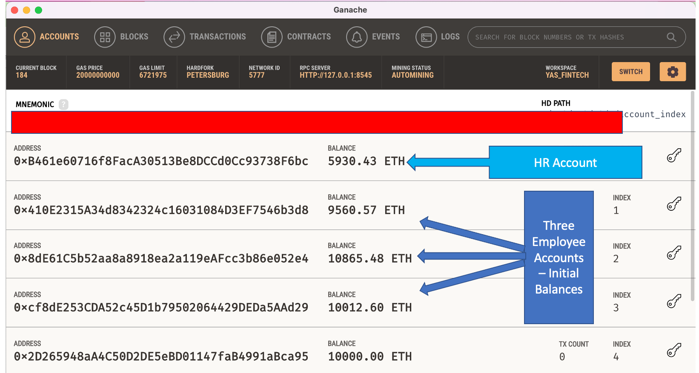
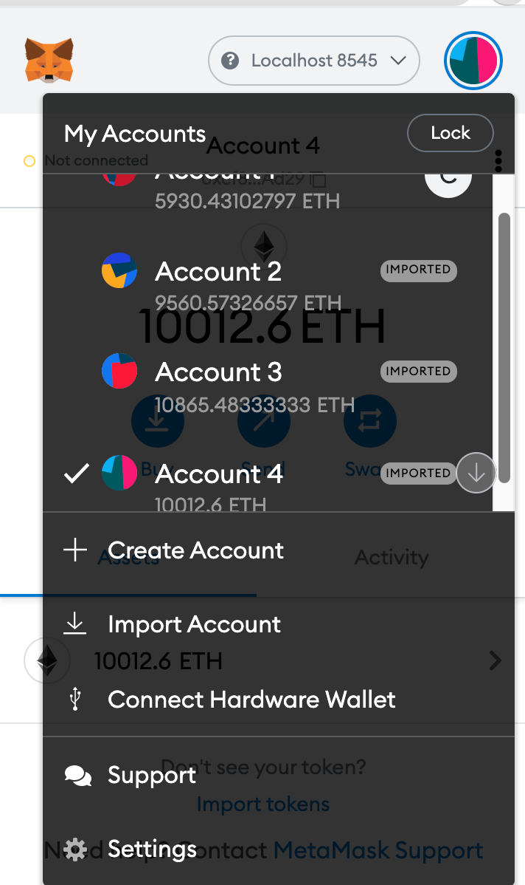
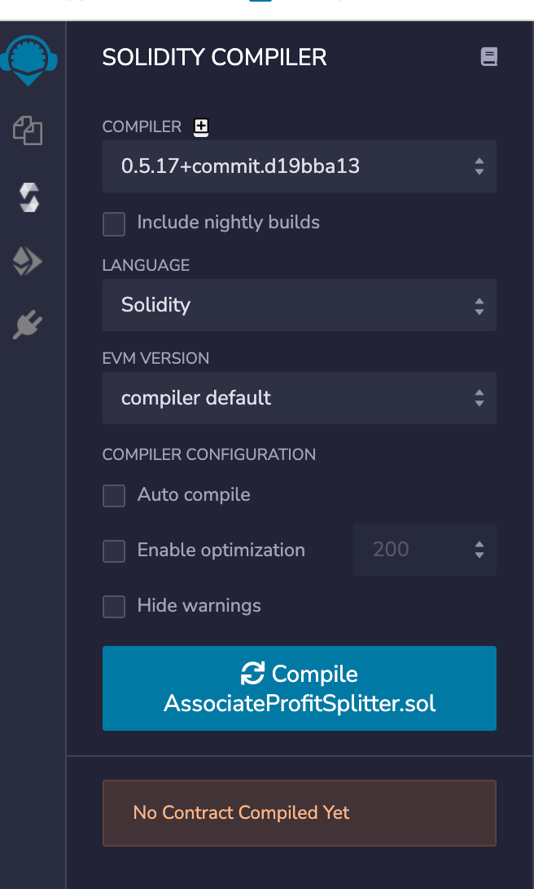
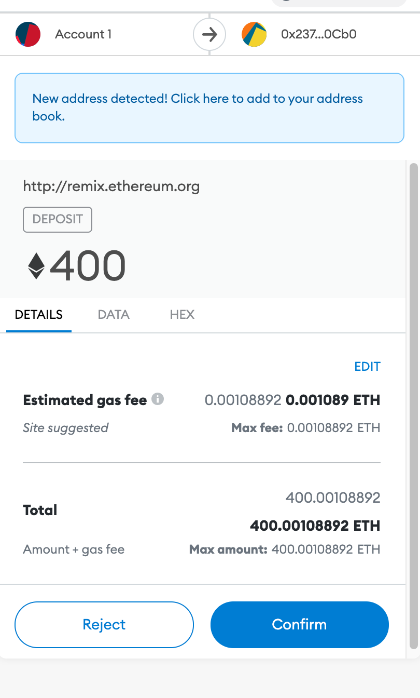
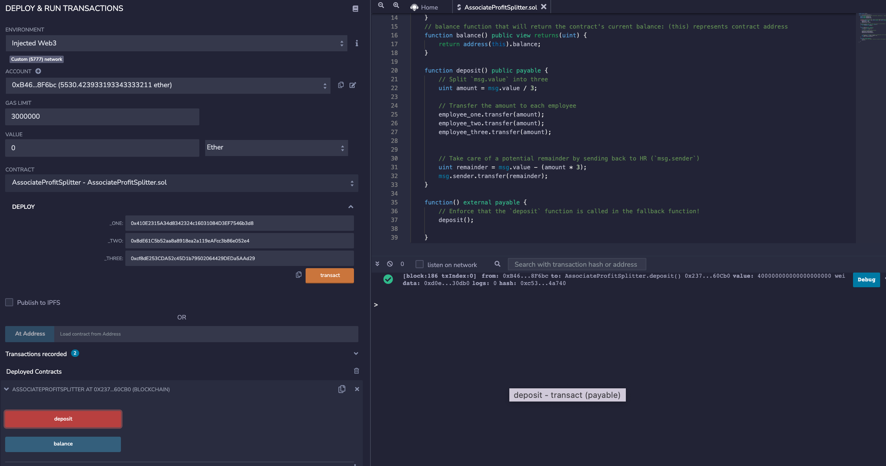
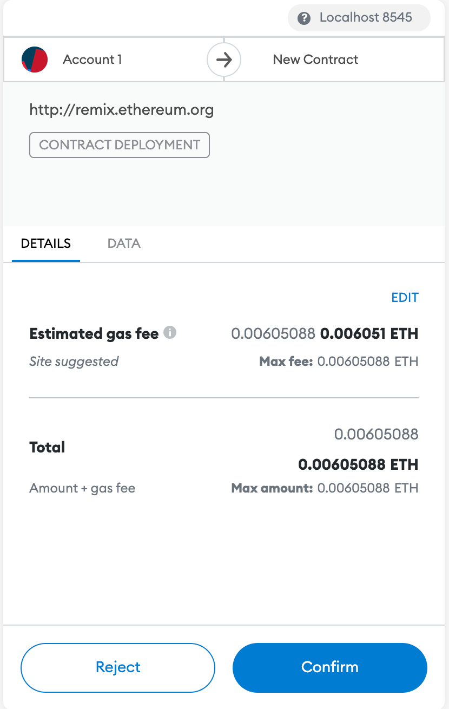
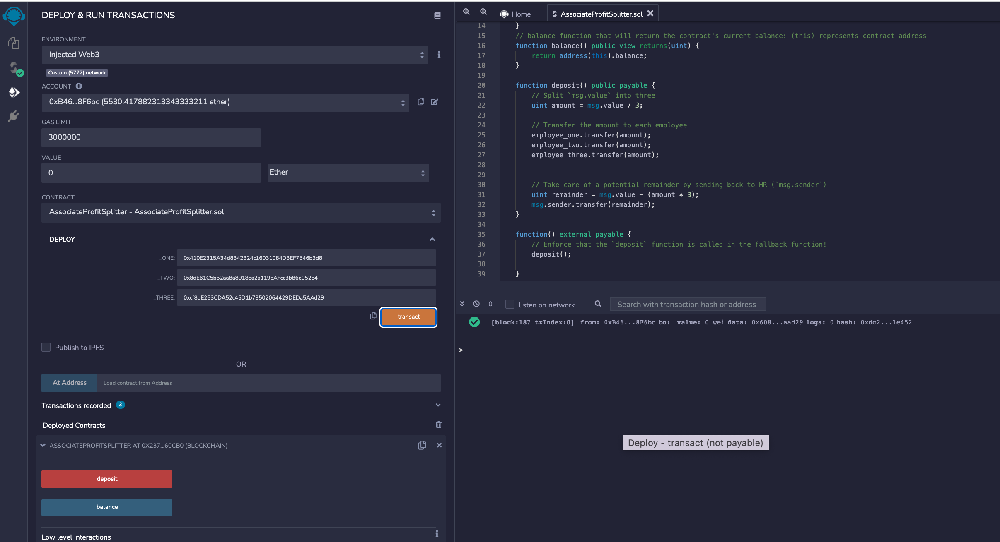
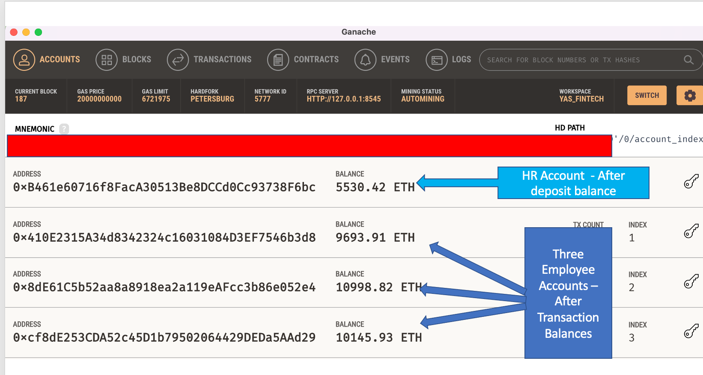
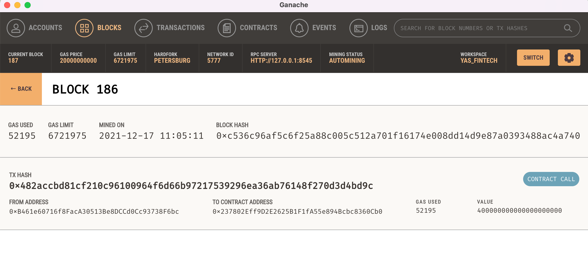
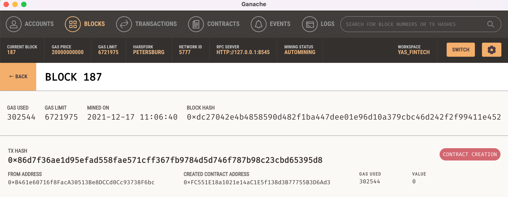

# Smart Contracts - Associate Profit Splitter

Your new startup has created its own Ethereum-compatible blockchain to help connect financial institutions, and the team wants to build smart contracts to automate some company finances to make everyone's lives easier, increase transparency, and to make accounting and auditing practically automatic!

I will create AssociateProfitSplitter smart contract with Solidity! This program (contract) will deposit Ether from Human Resources account into the AssociateProfitSplitter contract, and divide the Ether evenly among the associate level employees. That will allow the Human Resources department to pay employees quickly and efficiently.

* Pay your Associate-level employees quickly and easily.

Note: To run this program, you will need to download Ganache and create your accounts using mnemonic phrase. Plus, you need to install an extension METAMASK in Google Chrome.

## Instructions

### Step 1

With Ganache open and running, please open METAMASK (from your chrome browser) and select Localhost 8545. 
Navigate to the [Remix IDE](https://remix.ethereum.org) and create a new contract called `AssociateProfitSplitter.sol`.

### Step 2

Copy and Paste the following code:
------------------------------------------------------------------------------------------------------------

pragma solidity ^0.5.0;

contract AssociateProfitSplitter {
    // Create three payable addresses representing `employee_one`, `employee_two` and `employee_three`
    address payable employee_one;
    address payable employee_two;
    address payable employee_three;

    // Create a constructor function, and set set the employee addresses to equal the parameter values
    constructor(address payable _one, address payable _two, address payable _three) public {
        employee_one = _one;
        employee_two = _two;
        employee_three = _three;
    }
    // balance function that will return the contract's current balance: (this) represents contract address
    function balance() public view returns(uint) {
        return address(this).balance;
    }

    function deposit() public payable {
        // Split `msg.value` into three
        uint amount = msg.value / 3; 

        // Transfer the amount to each employee
        employee_one.transfer(amount);
        employee_two.transfer(amount);
        employee_three.transfer(amount);
        

        // Take care of a potential remainder by sending back to HR (`msg.sender`)
        uint remainder = msg.value - (amount * 3);
        msg.sender.transfer(remainder);
    }

    function() external payable {
        // Enforce that the `deposit` function is called in the fallback function!
        deposit();
        
    }
}

-----------------------------------------------------------------------------------------------------

### Step 3

click "Solidity Compiler", second option from top - left side of the Remix page. 

Make sure to have the correct compiler version selected, and leave other options as they appear. Click "compile AssociateProfitSplitter.sol" button.

### Step 4

click "Deploy and run transaction", third option from top - left side of the Remix page.

- Environment 
select "Injected Web3"
It should populate the correct account: Value should be 0, and select "Ether" from dropdown menu

- Deploy
select the dropdown next to deploy button, and add three employee accounts. I used a separate account as HR, and used the other three accounts (from ganache) for employees. 
click "transact"

It will/should open MetaMask. (this is first deployment without any value added - it will create a new transaction)

Hit Confirm

### Step 5

On Remix page, at the very bottom of left pane under deployed contracts, please click the dropdown next to "AssociateProfitSplitter at .......". You will see "deposit", and "balance" buttons there. 
With your accounts selected, please add desired value in "VALUE"to fund your contract.

Click "deposit" button

This will open MetaMask. You should see the contract amount there...

Hit Confirm

### Step 6

With the previous step, you have deposited money in your contract. On Remix page, next to deploy option - with three employees addresses showing, please hit "transact" button.

This will open MetaMask. 
Hit Confirm

Now you have deployed salary (pay) to your employees. 

### Step 7

Open Ganache, you should see the new balances under Accounts.
Confirm the new account balances, and select "Blocks" from the top options.
Select the latest Block #; you should find the details of your current transaction with transaction hashes there.

Here are the images:

