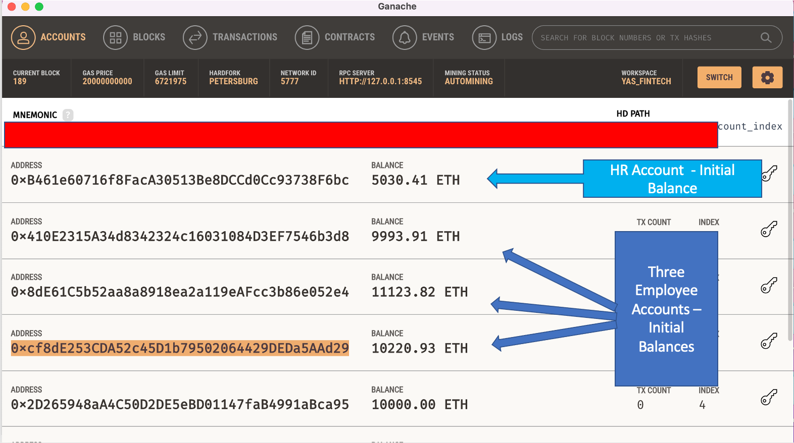
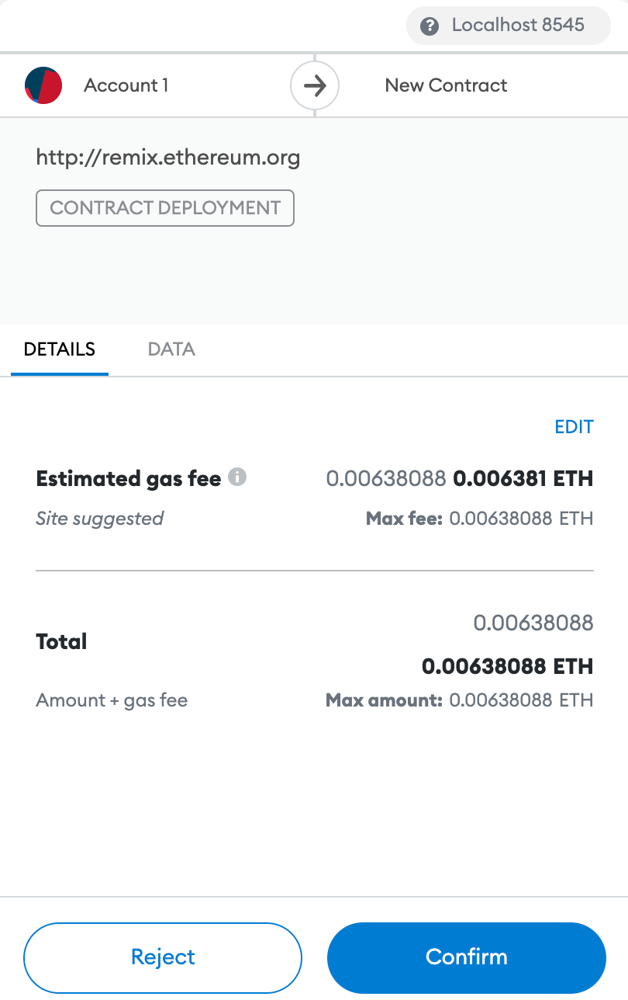
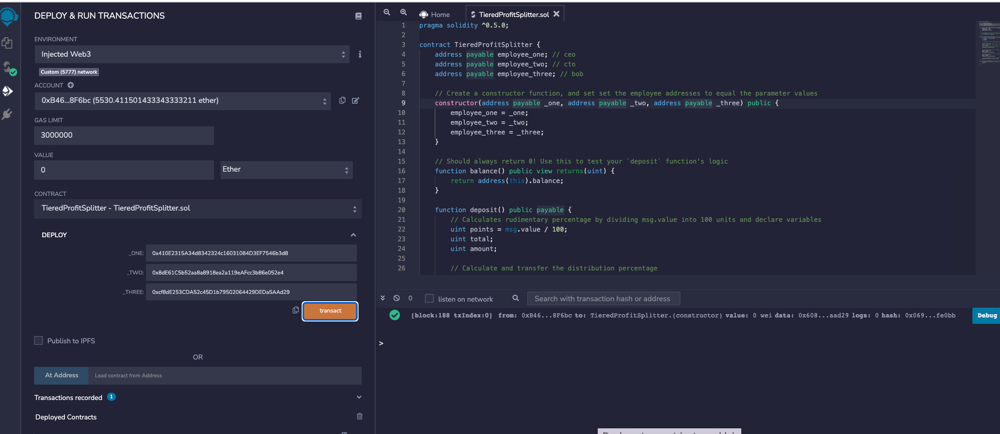
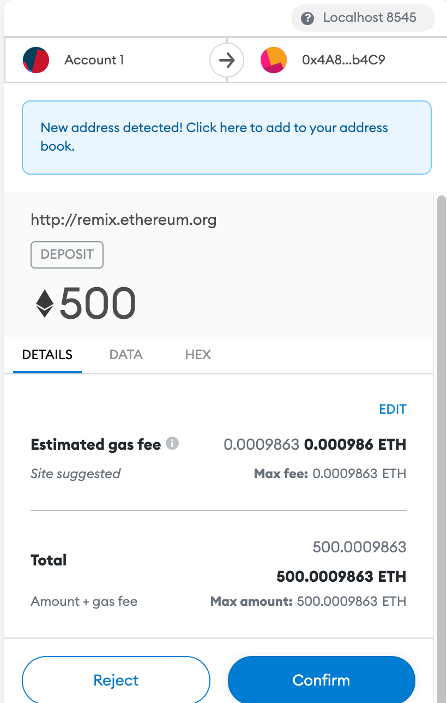
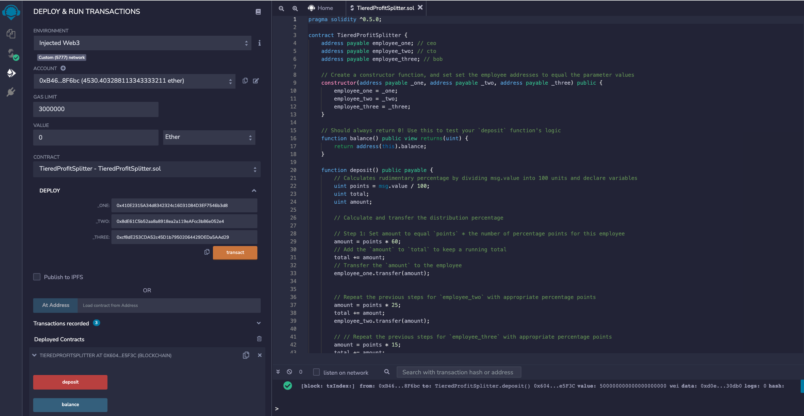
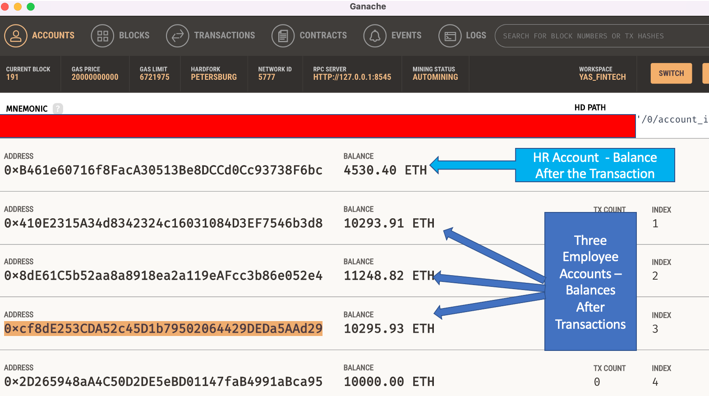
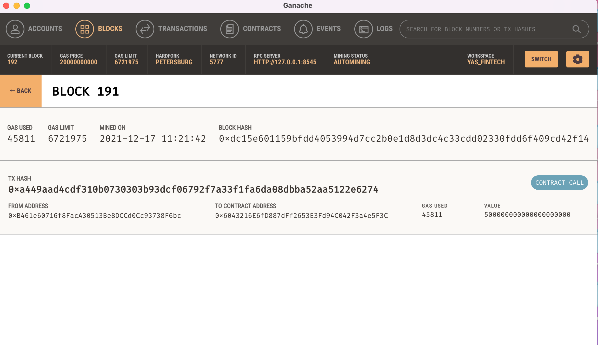
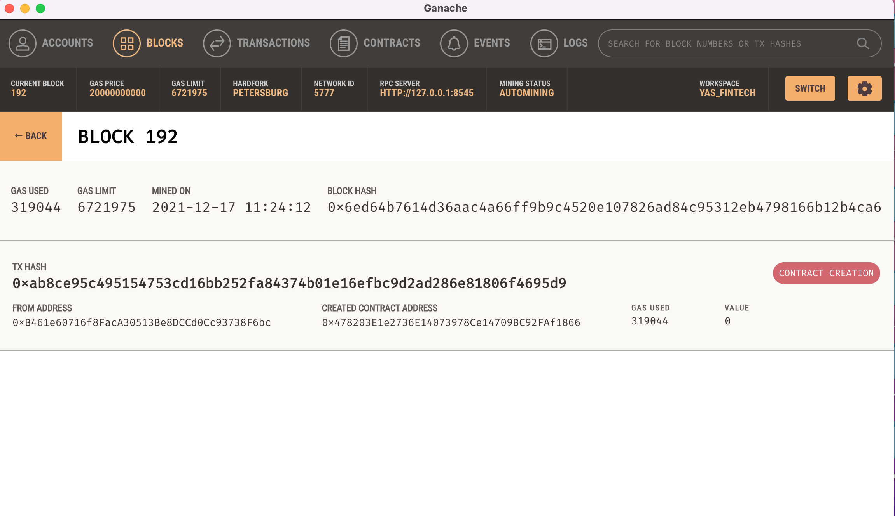

# Smart Contracts - Tiered Profit Splitter

In this contract, rather than splitting the profits between Associate-level employees, you will calculate rudimentary percentages for different tiers of employees (CEO, CTO, and Bob).

Note: To run this program, you will need to download Ganache and create your accounts using mnemonic phrase. Plus, you need to install an extension METAMASK in Google Chrome.

Here are the opening balances in Ganache:

## Instructions

### Step 1

With Ganache open and running, please open METAMASK (from your chrome browser) and select Localhost 8545. 
Navigate to the [Remix IDE](https://remix.ethereum.org) and create a new contract called `TieredProfitSplitter.sol`.
 

### Step 2

Copy and Paste the following code:
------------------------------------------------------------------------------------------------------------

pragma solidity ^0.5.0;

contract TieredProfitSplitter {
    address payable employee_one; // ceo
    address payable employee_two; // cto
    address payable employee_three; // bob

    // Create a constructor function, and set set the employee addresses to equal the parameter values
    constructor(address payable _one, address payable _two, address payable _three) public {
        employee_one = _one;
        employee_two = _two;
        employee_three = _three;
    }

    // Should always return 0! Use this to test your `deposit` function's logic
    function balance() public view returns(uint) {
        return address(this).balance;
    }

    function deposit() public payable {
        // Calculates rudimentary percentage by dividing msg.value into 100 units and declare variables
        uint points = msg.value / 100; 
        uint total;
        uint amount;

        // Calculate and transfer the distribution percentage

        // Step 1: Set amount to equal `points` * the number of percentage points for this employee
        amount = points * 60;
        // Add the `amount` to `total` to keep a running total
        total += amount;
        // Transfer the `amount` to the employee
        employee_one.transfer(amount);

        // Repeat the previous steps for `employee_two` with appropriate percentage points
        amount = points * 25;
        total += amount;
        employee_two.transfer(amount);

        // // Repeat the previous steps for `employee_three` with appropriate percentage points
        amount = points * 15;
        total += amount;
        employee_three.transfer(amount);

        // // ceo (employee_one) gets the remaining value
        employee_one.transfer(msg.value - total); 
    }

    function() external payable {
         // Enforce that the `deposit` function is called in the fallback function!
        deposit();
    }
}

-----------------------------------------------------------------------------------------------------

### Step 3

click "Solidity Compiler", second option from top - left side of the Remix page. 

Make sure to have the correct compiler version selected, and leave other options as they appear. Click "compile TierdProfitSplitter.sol" button.

### Step 4

click "Deploy and run transaction", third option from top - left side of the Remix page.

#### Environment: 

select "Injected Web3"
It should populate the correct account: 

#### Value 

should be 0, and select "Ether" from dropdown menu

#### Deploy:

select the dropdown next to deploy button, and add three employee accounts. I used a separate account as HR, and used the other three accounts (from ganache) for employees. 
click "transact"

It will/should open MetaMask. (this is first deployment without any value added - it will create a new transaction)

Hit Confirm

### Step 5

On Remix page, at the very bottom of left pane under deployed contracts, please click the dropdown next to "TieredProfitSplitter at .......". You will see "deposit", and "balance" buttons there. 
With your accounts selected, please add desired value in "VALUE" (scroll up to "Value" option) to fund your contract.

Click "deposit" button

This will open MetaMask. You should see the contract amount there...

Hit Confirm

### Step 6

With the previous step, you have deposited money in your contract. On Remix page, next to deploy option - with three employees addresses showing, please hit "transact" button.

This will open MetaMask. 
Hit Confirm

### Step 7

Open Ganache, you should see the new balances under Accounts.
Confirm the new account balances, and select "Blocks" from the top options.
Select the latest Block #; you should find the details of your current transaction with transaction hashes there.

Here are the images:

